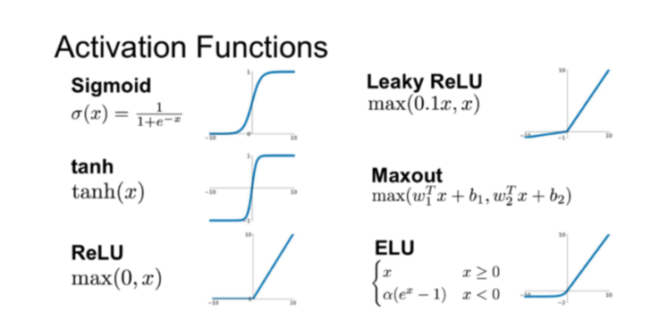

# Deep learning
- Tensorflow
- Pytorch
- skit-learn

## Perceptron

### Single perceptron
- 딥러닝의 시작점은 Perceptron
- w*x + b 의 합으로 시작
- 약간 linear regression과 비슷한 것 같음 각 피쳐별 가중치를 설정하는 방식

### Multiple Perceptron
- single perceptron은 XOR 처럼 linear하지 않은 경우에 한계가 있고, 그래서, 다중 퍼셉트론이 나옴.

#### 방식
- 피쳐값과 예측값 사이에, 여러 hidden layer를 추가함
- 히든 레이어의 노드 수는 임의로 정할 수 있고, 노드별로 값이 존재
- 노드의 값은 앞 레이어의 값에 가중치를 곱한 합에 b를 더한 후, activation function으로 값을 정재한 값임
- 히든 레이어 종류, 레이어의 노드 수, activation함수, 경사하강에 쓰는 optimizer, 손실함수 등을 설정해주면, 알아서 w와 b등을 설정해줌

#### 학습 로직
- W, b를 초기화 함(W는 랜덤값, b는 0)
- 순전파(forward propagation)로 예측 Y값 구함
  - 다중 퍼셉트론을 통해, 예측값을 구하는 것
  - W*x의 합 + b를 한 후, activation function으로 값을 정제(tanh, sigmoid, softmax, relu등)
- 손실함수로 손실값 구함
  - 순전파를 통해, 구한 예측값과 실제 값의 오차인 손실값을 손실함수로 구함
  - classification의 경우, logloss를 사용함
- 역전파 단계에서 경사하강법으로 W, b를 수정
  - learning_rate만큼 W, b를 바꿔줌
  - optimizer를 잘 설정해줘야 함

#### 효과
- 다중 레이어로 바꿈으로써, linear하지 않고, 각 피쳐가 독립적이지 않고, 의존성이 있는 경우에 대해서 구할 수 있음.
- Decision, regression tree 도 각 피쳐가 독립적이지 않을 때, 사용하는데
- 단순히 피쳐들 사이의 의존성을 찾는게 아니라, 피쳐들의 결합을 토대로 새로운 정보를 만들어 내고, 그 정보를 토대로 가중치도 만들어 내기 때문에,
- Decision, regression tree 보다 더 복잡한 케이스(이미지 분류, 자연어 처리등 비정형 데이터) 학습 가능

### 경사 하강법
- 손실함수로 구한 손실값을 최소화 하는 w,b등 매개변수를 구하는 것으로 여러 optimizer가 있음

#### 손실함수 Loss function
- 손실함수는 예측값과 실제값의 오차의 합을 구하는 것인데, 오차가 음수, 양수 모두 가능하므로 제곱을 해줌
- 이진 분류의 경우, binary_crossentropy, logloss 라는 공식 사용
- MSE(Mean Square Error): for regression task
- NLL(Negative Log Likelihood): for classification
- Cross Entropy: combine LogSoftmax and NLL

#### optimizer
- learning rate가 크면, 최소 지점을 초과하여, 최소 지점에 가기 어려울 수도 있을 듯
- learning rate가 작으면, 필요한 하강횟수가 많아져서, 학습 속도가 느려짐
- 매개변수와 손실 값 사이의 그래프가 일정하지 않을 경우, 더 작은 손실값이 가능하더라도, 못 찾는 경우가 있으므로, learning rate 및 optimizer종류를 잘 설정할 필요가 있음(일반적으로 adam을 많이 쓴다고 함)
- 학습시간을 고려하여, 처음에는 0.1로 시도해보고, 그 이후 0.01, 0.001 순으로 시도, learning rate schedule기법이라는게 있음

## CNN
- 이미지에서 사용한다는 것 같음

## Recurrent Neural Networks
- 자연어 처리할 때 씀
- LSTM등과 사용한다고 함.
- hidden unit이 자신을 호출하는 recurrent한 구조라고 함
- 시계열 처리하기 위해 탄생. 기존 신경망은 앞으로만 전진하는데 반해, rnn은 자기 자신을 참조
- 다중 퍼셉트론의 경우, 같은 레이어의 노드들은 독립적인데(앞단의 레이어의 노드들은 서로 연관이 가능), RNN의 경우, 같은 레이어의, 노드들이 서로 연관됨.
- 사용 예 : 음성 인식, 언어 모델링, 번역, 이미지 주석 생성

### LSTM
- https://colah.github.io/posts/2015-08-Understanding-LSTMs/

- Vanishing gradient probelm : RNN에서 같은 레이어의 노드들 끼리 연결되는 값은 동일 값. 해당 값이 노드들을 거칠수록 곱해지므로, 약간만 작아도, 값이 점차 작아지고, 약간만 커도, 엄청 커지는 문제가 있음
- 이 문제를 해결하기 위해서, LSTM이 나옴
- 옛날 정보를 기억할지, 잊어버릴지 조절

### Hidden Markov model

#### Markov model
- markov 가정 : 시간 t에서 관측은 가장 최근 r개의 관측에만 의존한다
사용 사례
  - 염기서열에서 유전자 찾기
  - 주어진 단어의 품사 추측
- 은닉 상태인 y를 예측할 때, 비터비(viterbi) 알고리즘 사용
  - 가장 가능성 높은 path를 결정하는 로직
- 학습시, 각 상태별 전이비율, 초기비율, 출력비율을 구하고, 예측시 전이확률, 초기확률, 출력확률을 구하여, 예측 상태값을 구함

### RNN 성능 개선 방법
- GRU 알고리즘
- 재귀적 드랍아웃
- 다적층 방법(유닛 수, 레이어수 늘리기)
- 양방향 RNN

## 용어
### epoch, batch size, iteration, round 의미
#### epoch
전체 데이터를 한번 학습하는 것을 의미
epoch 수만큼, 전체 데이터를 반복해서 학습
epoch 수가 작으면, underfitting, 많으면, overfitting되기 쉬움(xgb에는 round 증가시 성능 개선이 안되면, 중단하는 기능도 있음)
round는 xgb에서 쓰는 boosting 횟수를 의미. epoch과 동일한 의미라고 함

#### iteration
1epoch을 몇번에 걸쳐서 학습할지 횟수
전체 데이터를 메모리에 올려놓고 할 수 없을 경우, 여러번에 걸쳐서 학습을 한다.

#### batch
mini batch라고도 하는데,
한 iteration에서 돌아가는 데이터 사이즈

1 epoch = iteration * batch

## Activation function

- sigmoid : 출력 범위 0~1 사이. 결과 값이 하나일 경우, 0~1사이의 확률 값을 리턴하고 싶은 경우 사용.
- tanh : 출력 범위는 -1에서 1사이라는 점입니다. Sigmoid와 비교하여 tanh와는 출력 범위가 더 넓고 경사면이 큰 범위가 더 크기 때문에 더 빠르게 수렴하여 학습하는 특성
- Softmax : 3-class 이상의 classification을 목적으로 하는 딥러닝 모델의 출력층에서 일반적으로 쓰이는 활성화 함수(activation function)
- relu : 요즘에는 이걸 많이 쓴다고 함 (Rectified Linear Unit). 음수값을 0으로 변환.

## 생각

1. 경사 하강법은 처음에 임의의 값에서 시작하여, 가장 loss가 작은 지점으로 이동하여, weight와 bias를 구한다. 처음에, 가장 가능성이 있는 값부터 시작하면, 좀더 수월하지 않을까? 그리고, W와 b 모두에 learning rate를 주기 때문에, W는 괜찮은데, b가 문제라서, loss가 커진건지, 어떻게 알고 정확한 값을 찾지?
2. W,b가 가장 그럴듯한 값을 찾고, 거기서부터 learning rate만큼 전체 이동하고, 가장 밑 지점에 왔으면, W, b각각을수정해서, 최저점을 찾으면 어떨지? 경사하강법의 방식은 W와 b가 같이 움직이는 것 같음
3. 경사하강법으로 할 때, 맨 밑 지점이면, 반대 방향으로 이동하게 되면, 오히려 정확도가 떨어지는 경우가 있는데, 만약 이 때, 학습이 끝나게 되면, 덜 정확한 값을 사용하게 된다. 가장 오차가 적었던 때의 위치를 저장하고 있다가, 학습이 끝난 후, 가장 오차가 적었을 때로 사용하는게 좋지 않을지?