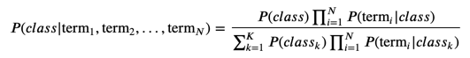

# ML Model

## Linear Model
피쳐가 독립적이라는 가정
피쳐 수를 줄일 수 있는 만큼 줄여서 독립적으로 의미있는 피쳐만 활용하는게 좋다 

### Naive Bayes

- 모든 피쳐가 독립적이라는 순수한(naive) 가정하에 쓰는 모델
- 여러 단어가 조합하여 feature importance가 높아지지 않는 경우에 사용
- 실제 자연어는 단어와 단어가 독립적일 수 없지만, TF.IDF와 비슷하여, 인기가 있다고 함.
- 스팸 메일 필터, 텍스트 분류, 감정 분석, 추천 시스템 등에 광범위하게 활용되는 분류 기법
- k : 클래스 수
- N : 피쳐 수
- P(term|class)는 term이 있을 때, class일 확률
- P(class) 전체 중 class의 비율
- P(class|term1,term2,termN) : term1~N이 있을 때, class의 확률
- 특정 클래스의 값 = (클래스 비율) * (각 term이 있을 때 class의 확률)
- 특정 클래스의 값 / 전체 클래스의 값의 합 = 특정 클래스의 확률
- Product Notation
  - Sigma는 덧셈을 하는 반면 이건 곱셈

## Decision, regression tree
피쳐 독립성을 가정하지 않음
회소한 경우에 가중치가 높게 측정되야 하는 경우도 있는데(IDF), 이 모델들은 회소한 것보다, 자주 발생하는 피쳐에 의해 영향을 받을 가능성이 높다고 함.
이러한 단점을 극복하기 위해서 stop-word removing을 적극적으로 해야 한다고 함.
random forest나 gradient boosted tree를 쓰면 이러한 어려움을 완화 할 수 있다고 함

### Random Forest
- 비선형적
- 여러 피쳐를 조합하여 feature importance가 높아 지는 경우도 찾을 수 있음

# 사용 케이스
## 분류 회귀 문제
로지스틱 회귀, 나이브 베이즈, 의사결정 트리가 인기 있다고 함.
의사결정 트리는 단어와 단어가 연관성이 클 때 쓰면 좋을듯.

