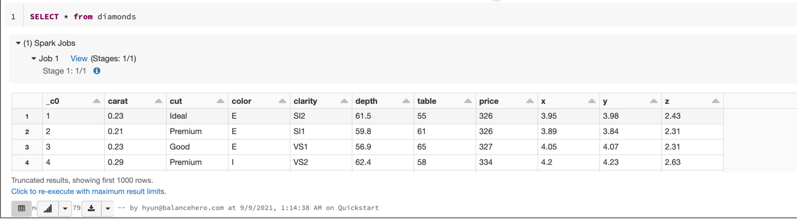
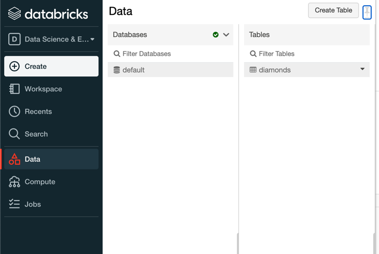

# Databricks
https://community.cloud.databricks.com/

무료 15GB momory, 2 Cores, 1DBU 제공.
2시간 사용 안하면 자동으로 꺼짐.

## 특징
- spark job 및 stage정보가 실행할 때 뜸.

- Sagemaker와 비슷한 역할을 하는 ML기능들이 있음
- spark에서 분산처리하여 ML tunning을 하고, tunning관련된 시각화를 제공함

### Data
사용하는 데이터들을 볼 수 있음
