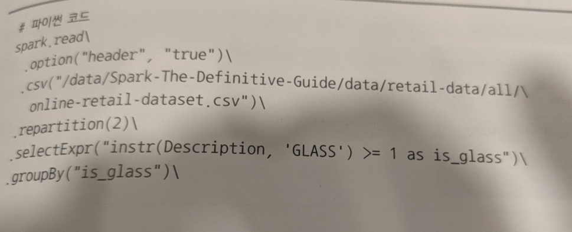
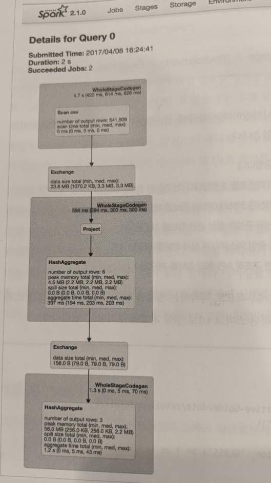
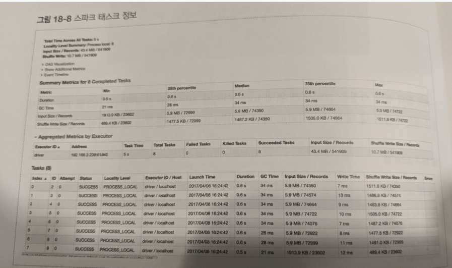

# DAG Understanding 2

## Scan CSV
- 8개의 테스크에서 처리됨. CSV는 병렬로 파일 읽기가 가능하여, 8개에서 병렬로 처리(스크린샷에는 안나오지만 Stage모니터링에 표시됨)

## Exchange
- shuffle이 발생할 때
- ex) repartition
- 예제에서는 2개의 파티션으로 exchange

## Project
- select/add/filtering column
- 예제에서 instr로 필터링한 경우에 해당
- repartition(2)이므로 2개의 테스크에서 처리됨

## HashAggregate
- 그룹별 갯수만 필요한 것이기 때문에, shuffle이 일어나진 않고,
- 각 파티션에서, group별 count를 구함
- 그래서, true, false, null을 각 파티션별로 해서 6개의 row가 만들어지는 듯

## Exchange
- 6개의 row들을 그룹별로 합산해야 하므로, exchange(shuffle)가 일어남
- 하지만, 각 파티션별로 aggregation은 일어났기 때문에, 통신하는 데이터는 6개로 적다는게 포인트
- 예제에서 200개의 파티션으로 exchange

## HashAggregate
- 6개의 row가 그룹별 파티셔닝되었고, 이걸 합산 하는 과정
- 3개의 row로 aggreate됨.
- 200개의 테스크에서 호출됨. 갯수가 별로 안되지만, 셔플 파티션 기본값이 200임.

- 태스크 정보는 각 테스크가 균형있게 데이터를 처리하느니, 한 테스크에 편향되게 처리하는지 확인하는데 도움이 됨