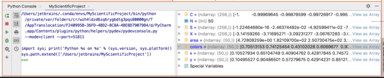
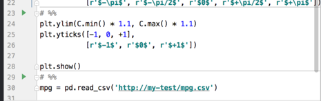
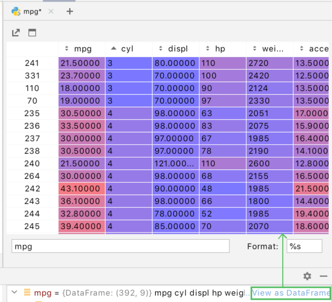

# Intellij Scientific Mode

## Reference
- https://www.jetbrains.com/help/idea/matplotlib-support.html#data

## Show variable explorer
- also able to use python shell with the variable.


## Split code into cells
```shell
# %%
```


## show Dataframe
