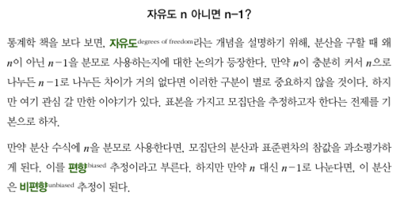

이산 데이터 : 사건의 발생 빈도 데이터

### [중심 경향치](https://ko.wikipedia.org/wiki/%EC%A4%91%EC%8B%AC%EA%B2%BD%ED%96%A5%EC%B9%98)

#### 평균
-  : 표본평균
- μ : 모집단의 평균

#### 표준편차
- σ 로 표현
- 평균 절대 편차 대신에, 표준편차를 구하는 이유

- 표준분산은 왜 n-1로 나눌까? 

  - 표본의 경우, 편향되기 때문이라는데, 잘 모르겠음

#### 분산
- Var(X), V(X) 등으로 표현

#### 기대값(expected value)
- E(X) 로 표현
- 정리하면, 일반적으로 '평균'과 '기댓값'은 같은 값을 가집니다. 그러나, '평균'은 "조사된 값들에 대해서 평균이 얼마인가"처럼, 확률적인 개념이 없을 때 쓰이고, '기댓값'은 각 사건들이 일어날 확률들을 가지고 있는 경우, 그 기대되는 값을 표현할 때 쓰입니다

#### 분포의 모멘트들
- 위치, 
- 변이, 
- 왜도(skewness) : 비대칭도. 데이터가 큰 값이나 작은 값 쪽으로 얼마나 비스듬히 쏠려 있는지
- 첨도(kurtosis) : 데이터가 극단(끝쪽에 차이가 많이 나는) 값을 갖는 경향성

#### 그래프
- https://en.wikipedia.org/wiki/Misleading_graph
- https://en.wikipedia.org/wiki/How_to_Lie_with_Statistics

### 선형적 상관계수
- 피어슨 상관계수 :  등간척도(간격척도)나 비례척도(비율척도)의 데이타에서 두 변수의 공분산(covariance) 을 각각의 표준 편차의 곱으로 나눈 값
  - 1이나 -1로 갈 수록 상관 관계가 높음
  - 0은 상관관계가 없음
  - 공분산 : 분산은 편차에 제곱을 하는데, 공분산은 a,b 두 피쳐가 있을 때, a의 편차 * b의 편차를 한다.
  - 상관계수는 데이터의 특잇값에 민감함. 아래에서 제공하는 함수들은 robust한 방식을 제공한다고 함
    - https://scikit-learn.org/stable/modules/classes.html#module-sklearn.covariance
- 추천 책
  - Statistics, 4th ed(W. W. Northon, 2007)