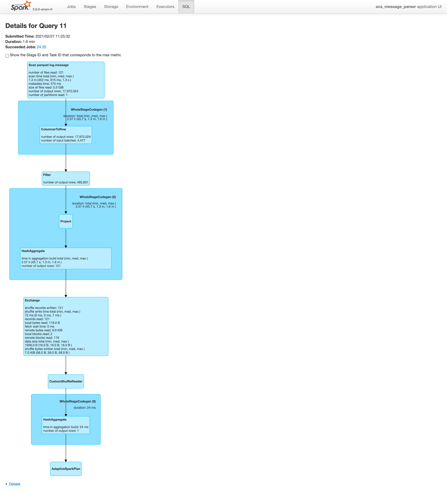
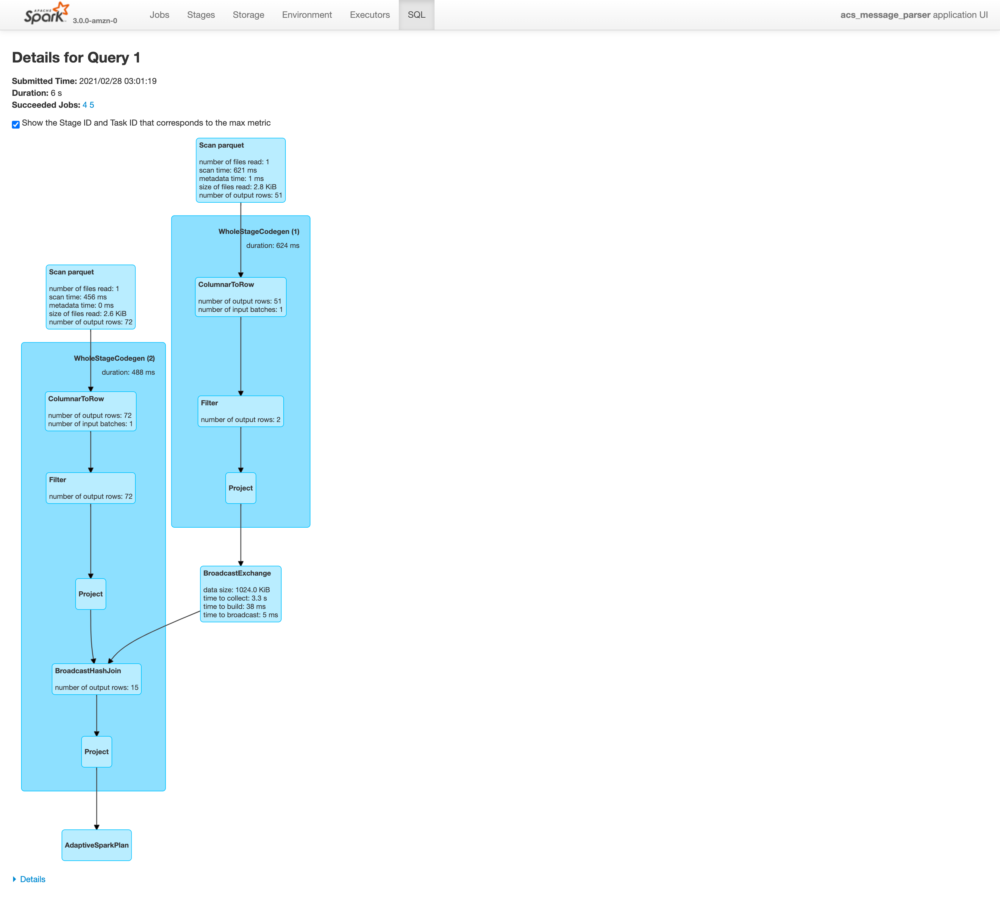
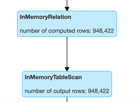

## SQL tab
- SQL tab shows detailed explanation of the plan
- show 'Parsed Logical Plan'
- show 'Analyzed Logical Plan'
- show 'Optimized Logical Plan'
- TODO : number of input batches: 4,477라는게 나오는데, input batches는 노드수를 말하는 건가? 테스크 갯수는 따로 명시되 있어서 아님.
  
  

- Join을 걸면 두번쩨 데이터가 Broadcast가 일어남(데이터 수가 작아서 broadcast가 일어나는 건지, 항상 broad cast가 일어나는 건지는 잘 모르겠음)
    - 두번쩨 데이터가 각 worker node로 보내지고, 각 worker node의 첫번째 데이터와 join이 일어

      

- Inmemory table scan은 캐시에서 가져올때를 말하는 듯(명시적 캐시처리 한 경)
    - 실질적 처리량이 많아야 하는 작업임에도, 처리속도가 짧음
    - 어떤 경우에 skipped로 뜨고, 어떤경우에 inmemory로 뜨는지는 정확하지 않음.
