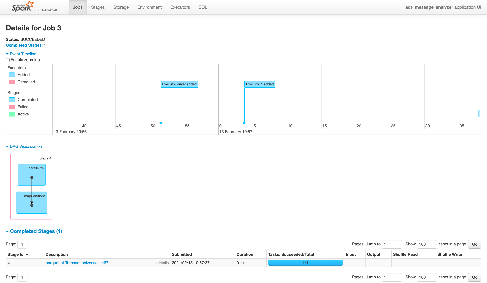

# Understanding DAG
- Job의 파란 블럭에 있는 이름은 작업의 이름을 의미
- Stage에 나오는 **RDD는 작업하여 나온 객체를 의미

- [ ] [DAG Explanation1](https://medium.com/teads-engineering/lessons-learned-while-optimizing-spark-aggregation-jobs-f93107f7867f)
- [ ] [DAG Explanation2](https://www.waitingforcode.com/apache-spark-sql/what-new-apache-spark-3-adaptive-query-execution/read)
- [ ] [DAG Explanation3](https://docs.databricks.com/spark/latest/spark-sql/aqe.html)
- [ ] [DAG Explanation4](https://databricks.com/blog/2015/06/22/understanding-your-spark-application-through-visualization.html)

## has 5 jobs

- 왜 잡이 5개나 있을까?
  - 기본적인 처리 할 때, 잡이 두개 생기는 듯하고(준비 작업 -> 처리 작업)
  - 읽고 쓰기를 두번 해서, 4개의 잡이 생겼고, window shuffle을 위해서 별도의 잡이 생성 된 것 같음

### Job No.0
- parallelize : parallel로 collection을 만들었다는 얘기인듯?
- mapPartitions : 파티션 분할 하여, 테스크 만드는 작업인가?
- scan parquest을 Job1 에서 하는 것으로 봐서, 이건, 뭔가 준비 동작인듯? 그래서, task deserialization하는데 시간이 오래 걸리지?

- Stage0

### Job No.1
- Scan parquet을 여기서 함.
- [WholeStageCodegen](https://stackoverflow.com/questions/40590028/what-do-the-blue-blocks-in-spark-stage-dag-visualisation-ui-mean)
  - 여러 operator를 하나로 합쳐서 처리함. 하나로 안합치면 속도가 느리니까
- DeserializeToObject : DataFrame의 row를 DataSet의 object로 변환할 
- ShuffleQueryStage : 다음에 일어날 window 처리를 위해 셔플 일어남

- Stage1

  

### Job No.2
- Stage 2 is skipped. Job no.1과 동일한 작업인데, 잡이 분할 되면서 왜 여기에 다시 언급이 된거지?
  - window 작업을 위해서, shuffle이 일어나서, 작업이 커져서 잡이 분할 된듯..?
- CustomShuffleReader : 다른 글에선, coalesced등 할 때, 발생하는데, plan에는 해당 정보가 보이는데, DAG Visualization에서는 안보이는 것 같음.. coalesced 외에 다른 케이스도 있나?
  - row_number() window 처리하면서 셔플이 일어난 것 같음
- Project : select할 때 발생하는 듯..? column추가 되거나 할 때..
- Sort : window의 orderby때문에 발생한듯.

- Stage 3

### Job No.3
- Job 0번처럼. read전에 준비 동작인듯..

- Stage 4
  

### Job No.4
- Scan parquest : 읽고,
- WholeStageCodegen : 변환 및 필터링
- Project : select 구문
- Sort : partitionby를 써서 저장해서, sort가 일어나는 듯.

- Stage 5
